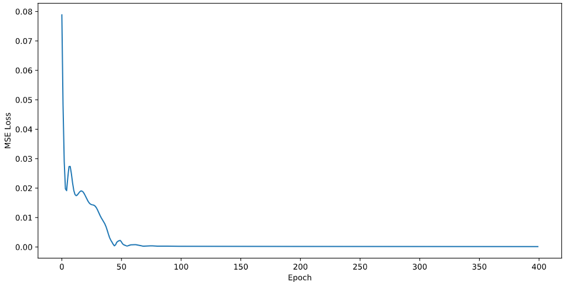
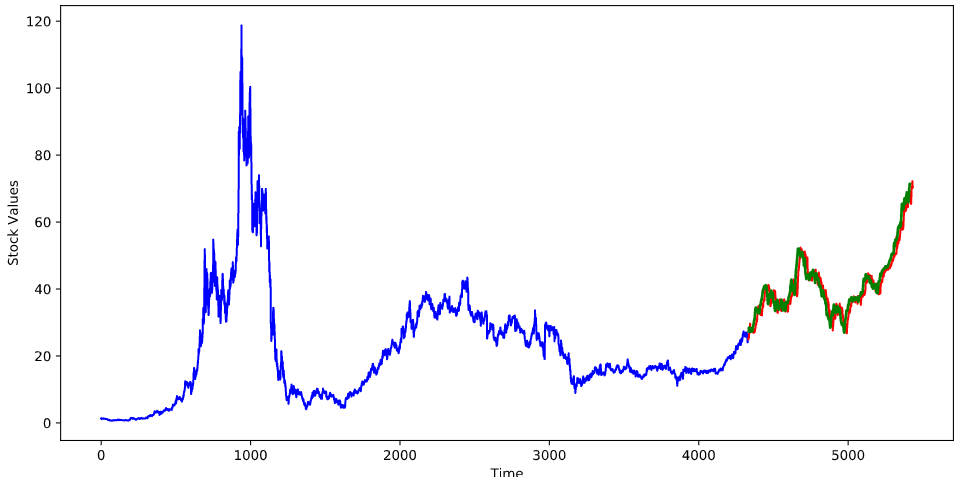

# Stock-Prediction-Model_pytorch
An GRU (Gated Recurrent Unit) model that can predict stops to an extremely well accuracies. Relies on Memory retention ability of LSTM/GRU models. The model being used to predict stock prices is an Autoregressive integrated moving average model. This model evaluates or predicts time series based on past data and behaviours.

Dataset for stock prediction was retrieved from https://github.com/nageshsinghc4/stock-market-forecasting

After a certain number of epochs, the loss of the model starts stagnating at which point, the model has converged:

## Loss Graph:

## Here is the result from the trained GRU model:

